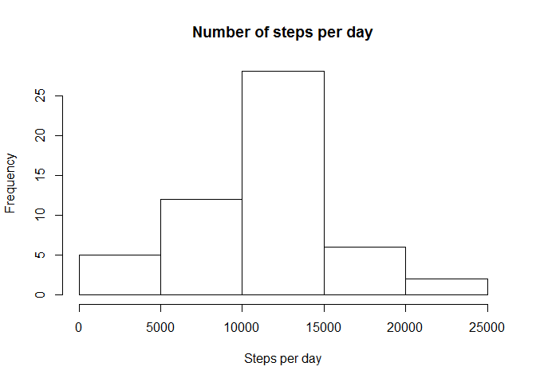
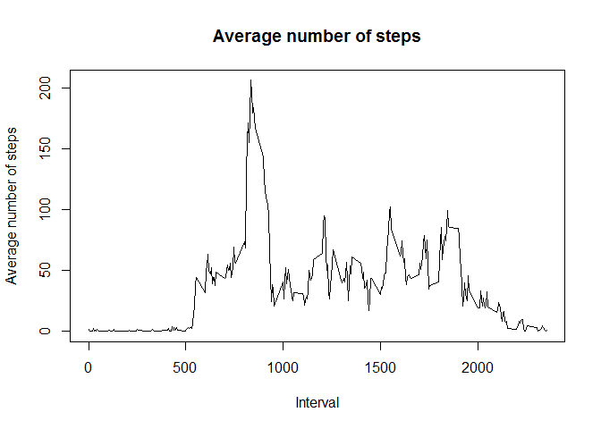
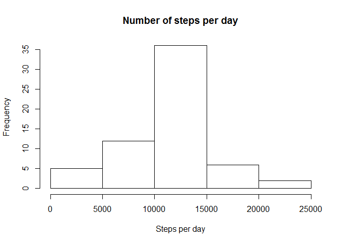
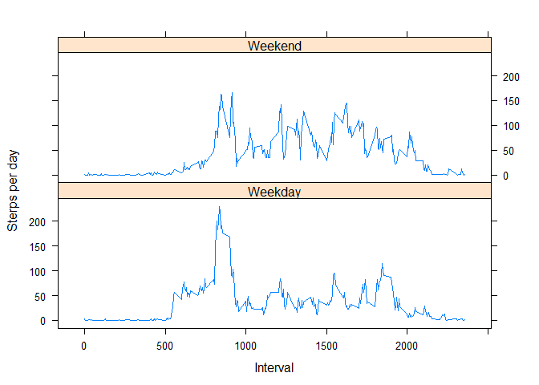

## Loading and preprocessing the data

```r
library(lattice)

filename = "activity.zip"
if(file.exists(filename)){
  unzip(filename)
}

dt <- read.csv("activity.csv", sep = ",", header = T)
dt$date <- as.Date(as.character(dt$date), "%Y-%m-%d")
```


## What is mean total number of steps taken per day?

```r
sm <- tapply(dt$steps, dt$date, sum, na.rm = T)
sm <- sm[sm!=0]
```


## What is the average daily activity pattern?

```r
hist(sm, main = "Number of steps per day", xlab = "Steps per day")
```

<!-- -->

```r
mean(sm)
```

```
## [1] 10766.19
```

```r
median(sm)
```

```
## [1] 10765
```

```r
stepsbyinterval = tapply(dt$steps, dt$interval, mean, na.rm = T)
plot(names(stepsbyinterval),stepsbyinterval, type = "l", main = "Average number of steps", xlab = "Interval", ylab = "Average number of steps")
```

<!-- -->

```r
mx <- stepsbyinterval[which.max(stepsbyinterval)]
names(mx)
```

```
## [1] "835"
```

```r
mx[[names(mx)]]
```

```
## [1] 206.1698
```

## Imputing missing values

```r
sum(is.na(dt$steps))
```

```
## [1] 2304
```

```r
newdt <- dt
for (idx in 1:nrow(newdt)){
    if (is.na(newdt[idx,]$steps)){
        newdt[idx,]$steps <- stepsbyinterval[[as.character(newdt[idx,]$interval)]]
    }
}
imputedmean <- tapply(newdt$steps, newdt$date, sum, na.rm = T)
hist(imputedmean, main = "Number of steps per day", xlab = "Steps per day")
```

<!-- -->

```r
mean(imputedmean)
```

```
## [1] 10766.19
```

```r
median(imputedmean)
```

```
## [1] 10766.19
```
## Are there differences in activity patterns between weekdays and weekends?

```r
newdt$daytype[weekdays(newdt$date) %in% c("Saturday","Sunday")] <- "Weekend"
newdt$daytype[!weekdays(newdt$date) %in% c("Saturday","Sunday")] <- "Weekday"
newdt$daytype <- as.factor(newdt$daytype)

imputeddata <- aggregate(steps ~ interval + daytype, newdt, mean)
xyplot(steps ~ interval | daytype, data = imputeddata, type="l", layout=c(1,2), xlab="Interval", ylab="Sterps per day")
```

<!-- -->
